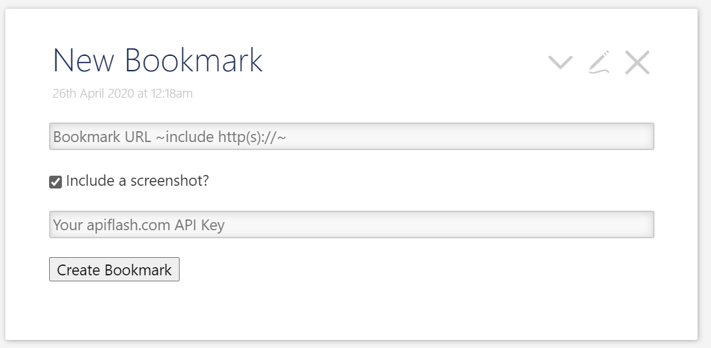

# TiddlyWiki-EasyBookmark

A TiddlyWiki bookmarking plugin that has for goal to create a **Bookmark** Tiddler by simply copy/paste the URL in a textbox

# Features:
* Create tiddler by copy / paste of a URL
* Can include a screenshot for the webpage thanks to __https://apiflash.com/__ API (get your API key for free)

# Change log
**2020-04-20**: v0.0.2 initial release

# Installation
 Download the [JSON file](https://github.com/akhater/TiddlyWiki-EasyBookmark/blob/master/%24__ak_plugins_EasyBookmark.json) and drag/drop it in your TiddlyWiki
 
 # Usage
1. Go to your __New Bookmark__ Tiddler 
2. Paster the URL you want to bookmark *including* http(s)://
3. Select *include a screenshot* if you want
4. add your *apiflash.com* API key for screenshot processing
5. click on *Create Bookmark*
 
 
 # Credits
 * **__https://apiflash.com/__** for the free API for screenshots
 * **__http://textance.herokuapp.com/** for the free API to retreive website title
 * **[TiddlyWiki community](https://groups.google.com/forum/#!forum/tiddlywiki)**
 * **[inmysocks](http://inmysocks.tiddlyspot.com/#New%20Tiddler%20Form)** for showing me how to use forms
 * **[Paulin Gjini](https://groups.google.com/forum/m/#!topic/tiddlywiki/E_X3KUHOvEk)** for the inspiration on the .js script
 
 
 
 # Discussion 
 https://groups.google.com/forum/#!topic/tiddlywiki/pr42e29nwU8
 
 # N.B.
 I am totally new to all this so take everything with a grain of salt :)
